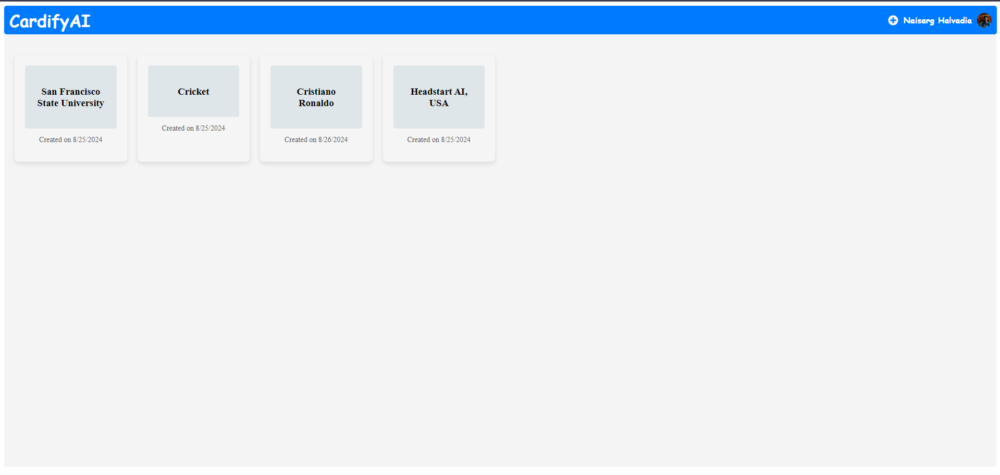

# CardifyAI

CardifyAI is a web application designed to generate educational flashcards based on a given topic. It leverages the power of Clerk API for user authentication and Gemini API for generating flashcard content, providing a seamless and interactive experience for users. The app is built using **React.js** and also includes user analytics capabilities.

## Features

- **User Authentication**: Integrated with [Clerk API](https://clerk.dev/) for secure user login and registration.
- **Flashcard Generation**: Uses [Gemini API](https://example.com) to generate educational flashcards based on user-provided topics.
- **User Analytics**: Collects and displays analytics for users, allowing insights into app usage.
- **Customizable Prompts**: The prompt for Gemini API calls is defined in the `gemini.js` file, allowing for easy prompt engineering and customization.

## Screenshots





## Tech Stack

- **Frontend**: React.js
- **User Authentication**: Clerk API
- **Flashcard Content Generation**: Gemini API
- **User Analytics**: Clerk API

## Installation

To get a local copy up and running, follow these simple steps.

### Prerequisites

Make sure you have the following installed:

- [Node.js](https://nodejs.org/) (v14 or higher)
- [npm](https://www.npmjs.com/get-npm)

### Setup

1. Clone the repository:

   ```bash
   git clone https://github.com/nh0397/CardifyAI
   cd CardifyAI
   ```
2. Install dependencies:
    ```
    npm install
    ```
3. Set up environment variables:

    Create a .env file in the root directory of the project and add the following:
    ```
    REACT_APP_CLERK_PUBLISHABLE_KEY=your-clerk-publishable-key
    REACT_APP_API_KEY=your-gemini-api-key
    REACT_APP_FIREBASE_API_KEY=your-firebase-api-key
    ```
- You can get your Clerk publishable key from the [Clerk API dashboard](https://dashboard.clerk.com/apps/).
- The Firebase API key is required for additional integrations (e.g., user analytics or database usage).


### Running the App
To start the development server, run:
```
npm start
```
The app will be available at http://localhost:3000.

### Usage
- Log in or sign up using the integrated Clerk authentication.
- Once authenticated, enter a topic for which you want to generate flashcards.
- The app will use the Gemini API to create flashcards for the entered topic.
- View and study the generated flashcards, with additional features for user analytics.
- Customizing Prompts
    - The prompt sent to the Gemini API is defined in the gemini.js file. If you want to modify or engineer the prompt, you can find it there:
```
// gemini.js
```
Feel free to tweak this prompt to improve or alter the flashcard generation.

### Learn More
- Clerk API Documentation: https://clerk.dev/docs
- Firebase API Documentation: https://firebase.google.com/docs
- Gemini API Documentation: https://ai.google.dev/gemini-api/docs

### Contributing
Contributions are welcome! Please follow these steps to contribute:

- Fork the repository.
- Create your feature branch: git checkout -b feature/YourFeature.
- Commit your changes: git commit -m 'Add some feature'.
- Push to the branch: git push origin feature/YourFeature.
- Open a pull request.